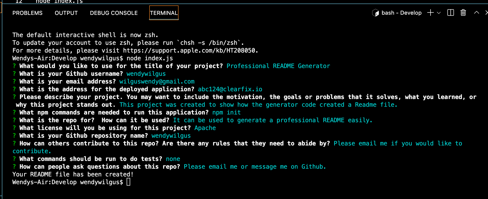

# Professional README Generator

## Description

The purpose of this project is to allow users to quickly and easily create a README file by using a command-line application to generate one. This allows the project creator to devote more time to working on the project.

This command-line application dynamically generates a professional README.md file from a user's input using the [Inquirer package](https://www.npmjs.com/package/inquirer/v/8.2.4). 

The application will be invoked by using the following command:

```bash
node index.js
```

## Table of Contents

- [Story](#user-story)
- [Mockup](#mockup) 
- [Languages Used](#languages)
- [Credits](#credits)
- [Resources](#resources)

## User Story

```md
AS A developer
I WANT a README generator
SO THAT I can quickly create a professional README for a new project
```

## Acceptance Criteria

```md
GIVEN a command-line application that accepts user input
WHEN I am prompted for information about my application repository
THEN a high-quality, professional README.md is generated with the title of my project and sections entitled Description, Table of Contents, Installation, Usage, License, Contributing, Tests, and Questions
WHEN I enter my project title
THEN this is displayed as the title of the README
WHEN I enter a description, installation instructions, usage information, contribution guidelines, and test instructions
THEN this information is added to the sections of the README entitled Description, Installation, Usage, Contributing, and Tests
WHEN I choose a license for my application from a list of options
THEN a badge for that license is added near the top of the README and a notice is added to the section of the README entitled License that explains which license the application is covered under
WHEN I enter my GitHub username
THEN this is added to the section of the README entitled Questions, with a link to my GitHub profile
WHEN I enter my email address
THEN this is added to the section of the README entitled Questions, with instructions on how to reach me with additional questions
WHEN I click on the links in the Table of Contents
THEN I am taken to the corresponding section of the README
```

## Mock-Up

Please watch a video of the functionality here: https://capture.dropbox.com/DQ1WTzcbryuCBLiB
The following image shows the application's appearance and functionality when initiated in the terminal: 


## ## Languages Used
The following languages were used to create this project:

- JavaScript

- Node.js

- Inquirer.js


## Credits

This project was completed as part of Georgia Tech's Full Stack Development Boot Camp course. 


## Resources
- ReadMe 
	- https://coding-boot-camp.github.io/full-stack/github/professional-readme-guide 
	- https://www.makeareadme.com/
	- https://dev.to/coderarchive/writing-a-high-quality-readme-1k3j
- Badges: https://shields.io/
- Inquirer.js https://www.npmjs.com/package/inquirer/v/8.2.4